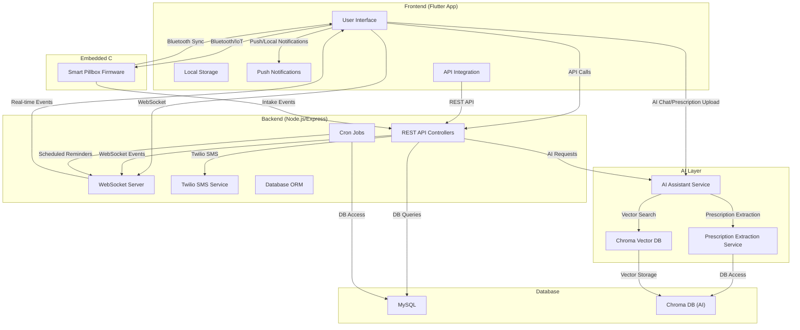
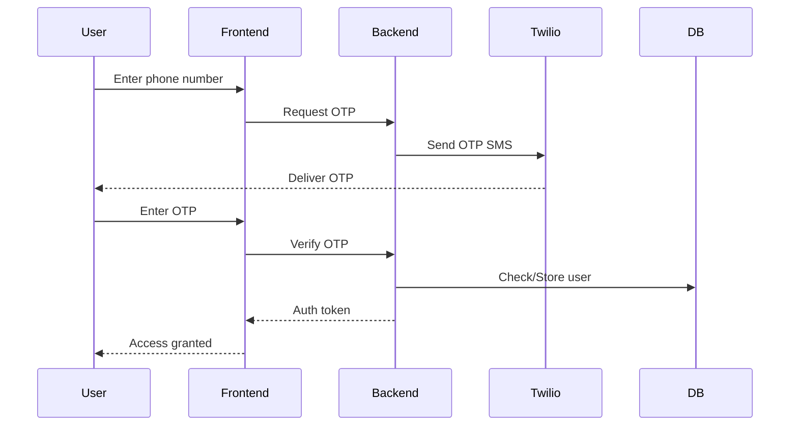
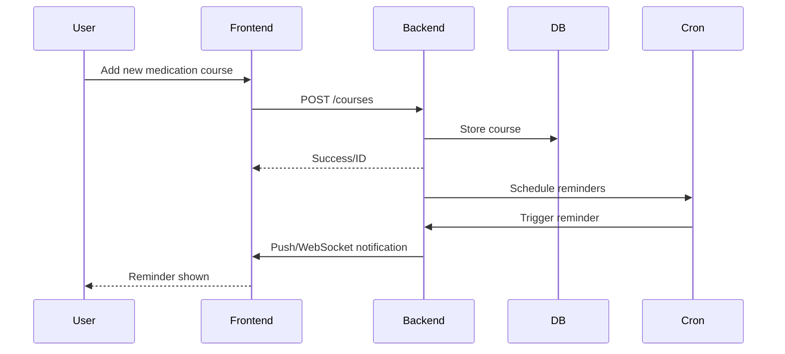
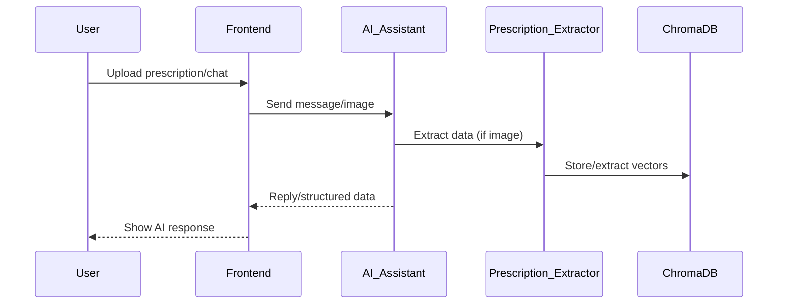
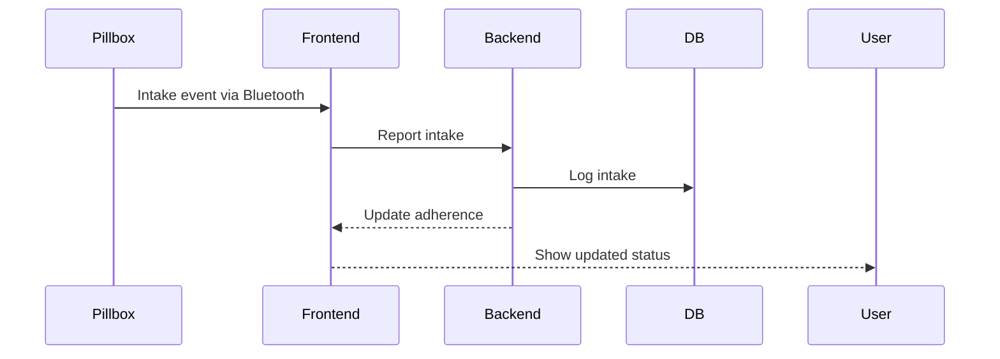

# 🩺 HealthMobi

An innovative healthcare management system designed to help patients track medication intake, connect with doctors, and maintain a healthier lifestyle.

> **💻 Developed by Gameis Alice Team from PICT College**

## 🌟 Overview

HealthMobi is a comprehensive healthcare platform that bridges the gap between doctors and patients. The application helps users manage their medication courses, receive timely reminders, track medication adherence, and maintain communication with healthcare providers.

## ✨ Key Features

- **🔐 Authentication System**: Secure phone-based OTP authentication
- **💊 Medication Management**: Create and track medicine courses with customizable schedules
- **⏰ Smart Notifications**: Automated reminders for medicine intake
- **📊 Adherence Tracking**: Visual matrix to track medication compliance over time
- **📱 Real-time Updates**: WebSocket-based instant notifications and updates

## 🤝 Interactive Features

- **📲 Medication Intake Confirmation**: Interactive notifications and allow patients to confirm medication intake with a single press
- **🔔 Smart Reminders**: Context-aware notifications that adjust timing based on user behavior patterns
- **💬 Intelligent AI Assistant**: Intuitive AI-powered chat system that allows patients to effortlessly update meal times, medication schedules, and health routines with natural language commands
- **📊 Progress Visualization**: Interactive charts showing adherence trends and health improvements
- **🔄 Sync Across Devices**: Seamless experience across mobile and pillbox


 [](https://drive.google.com/file/d/1xmnK6s_Wbw5SY_ZkHk-FGimg-aUSNLFQ/view?usp=drive_link)

    


## 🛠️ Technical Architecture

### Backend Components

- **Express Server**: RESTful API endpoints for all app features
- **MySQL Database**: Stores user data, medication courses, and intake records
- **WebSockets**: Real-time communication for notifications and updates
- **Cron Jobs**: Scheduled tasks for medication reminders and daily quote refreshing
- **Twilio Integration**: SMS-based OTP verification and notifications

### Frontend Components

- **Flutter**: Cross-platform mobile application
- **Modern UI/UX**: Intuitive user interface for all features
- **Local Storage**: Caching for offline functionality
- **Push Notifications**: Real-time alerts for medication reminders

### Embedded Systems

- **IoT Integration**: Support for smart medication pill box 
- **Adherence Monitoring**: Integration with intake tracking sensors

### Database Schema

The application uses a relational database with tables for:

- Users 
- Authentication tokens
- Prescription images
- Medication courses
- Medicine course
- Medicine intake
- Daily motivational quotes

## 🚀 Getting Started

### Prerequisites

- Node.js (v14+)
- MySQL Server
- Twilio Account (for SMS features)
- Cloudinary Account (for media storage)

### Backend Installation

1. Navigate to the Backend directory
2. Install dependencies:
   ```
   npm install
   ```
3. Set up your environment variables in `.env`
4. Initialize the database using `main.sql`
5. Start the server:
   ```
   npm start
   ```

### Frontend Installation

1. Navigate to the Frontend directory
2. Install dependencies
3. Configure the app to connect to your backend
4. Run the development server

## 📱 Mobile Client

The mobile application provides:

- User-friendly medication tracking interface
- Reminders and notifications
- Medication adherence insights and analytics

## 💡 Unique Features

- **Quote of the Day**: Daily motivational health quotes in the user's preferred language
- **Visual Medication Adherence**: Intuitive matrix display showing medication compliance
- **Custom User Notes**: Personal health notes for patients to track symptoms and progress

## 🔒 Security Features

- Token-based authentication
- Secure OTP verification

## 🌈 Future Roadmap

- AI-powered health insight
- Integration with wearable health devices
- Expanded language support

## 🌍 Open Source Initiative

HealthMobi is planning to transition to an open source model to foster innovation and collaboration in healthcare technology. Our mission is to make quality healthcare management accessible to everyone.

## 🧩 Integration Opportunities

- **Health Wearables**: API hooks for smartwatches and fitness trackers
- **EHR Systems**: Integration with electronic health record systems
- **Pharmacy Networks**: Direct connection with medical systems
- **Telehealth Platforms**: API for video consultation integration

## 📄 License

This project is licensed under the [MIT License](LICENSE).


---

# 🛠️ Detailed Technical Documentation

## System Architecture Overview



### Component Responsibilities

- **Frontend (Flutter):**
  - User interface for patients and doctors
  - Handles authentication, medication tracking, chat, and notifications
  - Communicates with backend via REST API and WebSocket
  - Integrates with smart pillbox via Bluetooth/IoT

- **Backend (Node.js/Express):**
  - Exposes RESTful API endpoints for all app features
  - Manages authentication, user roles, medication courses, and notifications
  - Handles real-time updates via WebSocket
  - Runs cron jobs for reminders and daily quotes
  - Integrates with Twilio for SMS/OTP
  - Interfaces with MySQL for persistent storage

- **AI Layer:**
  - **AI Assistant Service:** Natural language chat, health queries, and schedule updates
  - **Prescription Extraction Service:** Extracts structured data from prescription images/voice
  - **Chroma Vector DB:** Stores and retrieves vectorized data for semantic search

- **Embedded C (Smart Pillbox):**
  - Tracks physical medication intake events
  - Syncs with mobile app via Bluetooth
  - Sends intake confirmations to backend

- **Database:**
  - **MySQL:** Main relational DB for users, courses, intakes, etc.
  - **Chroma DB:** Vector database for AI semantic search and prescription data

---

## Main Data & Control Flows

### 1. User Authentication & Onboarding



### 2. Medication Course Creation & Tracking



### 3. AI Assistant Chat & Prescription Extraction



### 4. Smart Pillbox Integration



---

## Detailed Component Interactions

- **Medication Reminders:**
  - Cron jobs in backend schedule reminders based on user’s medication course.
  - Reminders are sent via push notification (mobile) and/or SMS (Twilio).
  - Intake confirmation updates adherence matrix in DB.

- **AI Assistant:**
  - Handles natural language queries (e.g., "Change my breakfast time to 8am").
  - Can extract structured data from prescription images/voice using the extraction service.
  - Uses Chroma DB for semantic search and context.

- **Doctor-Patient Communication:**
  - Real-time chat via WebSocket.
  - Doctors can send prescriptions (text/image/voice) to patients.

- **Security:**
  - All sensitive operations require token-based authentication.
  - OTP verification for login/registration.
  - Role-based access for doctor/patient features.

---

# 📂 Module Documentation

See the README.md in each major subdirectory for deep dives into:
- [AI Layer](./AI%20Layer/AI%20Assistent%20Service/doc.md)
- [Backend](./Backend/doc.md)
- [Embedded C](./Embedded%20C/doc.md)
- [Frontend](./Frontend/doc.md)

---

# 🗺️ Navigation

- [Project Root](./README.md)
- [AI Layer](./AI%20Layer/AI%20Assistent%20Service/doc.md)
- [Backend](./Backend/doc.md)
- [Embedded C](./Embedded%20C/doc.md)
- [Frontend](./Frontend/doc.md)

---

## 🤝 Contributing 

We welcome contributions from everyone! Please read our [Contributing Guidelines](contributing.md) to get started.

## 📌 FAQ
See the [FAQ.md](./FAQ.md) for setup help and troubleshooting.

<p align="center">
  <a href="#top" style="font-size: 18px; padding: 8px 16px; display: inline-block; border: 1px solid #ccc; border-radius: 6px; text-decoration: none;">
    ⬆️ Back to Top
  </a>
</p>
